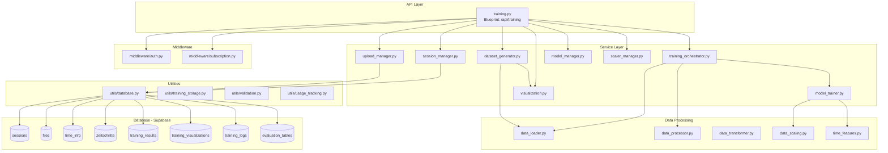
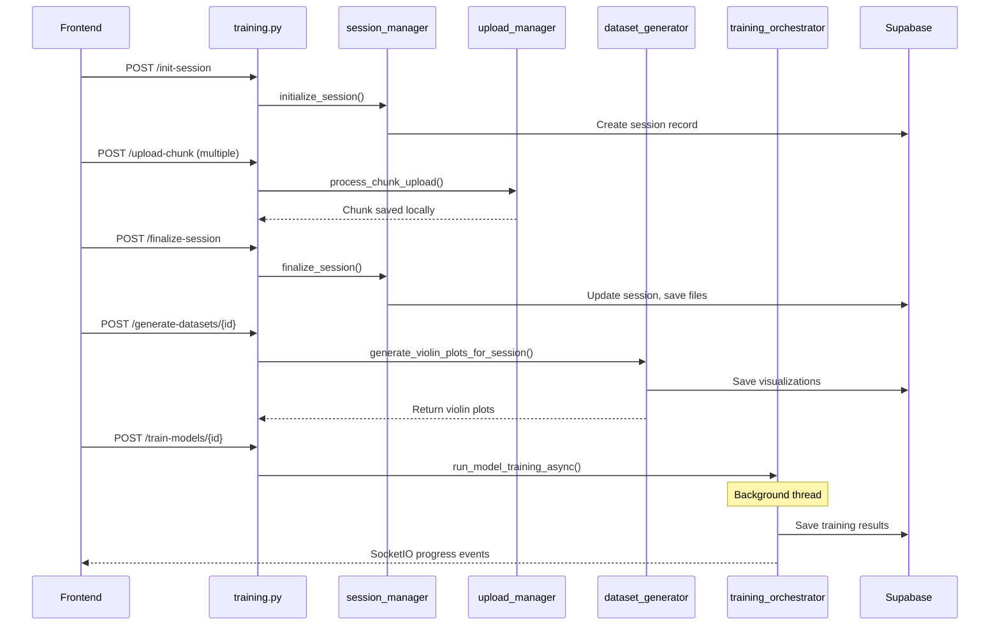

# Training System Documentation

Complete documentation for the training system in Backend_RabensteinerEng.

---

## Overview

**File**: `api/routes/training.py`
**Lines of Code**: 2329
**Blueprint**: `training_bp` registered at `/api/training`
**Purpose**: Core ML training orchestration - file upload, session management, model training, and results visualization

---

## Architecture Diagram



---

## Data Flow Pipeline



---

## All Endpoints (35 Routes)

### Session Management (11 endpoints)

| Route | Method | Decorators | Purpose |
|-------|--------|------------|---------|
| `/init-session` | POST | @require_auth | Initialize new upload session |
| `/finalize-session` | POST | @require_auth | Finalize session after uploads |
| `/list-sessions` | GET | @require_auth | List user's sessions |
| `/session/<session_id>` | GET | @require_auth | Get session from local storage |
| `/session/<session_id>/database` | GET | @require_auth | Get session from Supabase |
| `/session-status/<session_id>` | GET | @require_auth | Get upload progress status |
| `/session/<session_id>/delete` | POST | @require_auth | Delete session + files |
| `/delete-all-sessions` | POST | @require_auth | Delete ALL sessions |
| `/create-database-session` | POST | @require_auth | Create Supabase session |
| `/get-session-uuid/<session_id>` | GET | @require_auth | Get UUID for string ID |
| `/session-name-change` | POST | @require_auth | Rename session |

### File Operations (5 endpoints)

| Route | Method | Decorators | Purpose |
|-------|--------|------------|---------|
| `/upload-chunk` | POST | @require_auth, @require_subscription, @check_processing_limit | Upload file chunk |
| `/csv-files/<session_id>` | GET | @require_auth | List CSV files for session |
| `/csv-files` | POST | @require_auth, @require_subscription, @check_processing_limit | Create CSV file entry |
| `/csv-files/<file_id>` | PUT | @require_auth | Update CSV file metadata |
| `/csv-files/<file_id>` | DELETE | @require_auth | Delete CSV file |

### Time Configuration (4 endpoints)

| Route | Method | Decorators | Purpose |
|-------|--------|------------|---------|
| `/save-time-info` | POST | @require_auth | Save time features config |
| `/save-zeitschritte` | POST | @require_auth | Save timestep config |
| `/get-time-info/<session_id>` | GET | @require_auth | Get time features |
| `/get-zeitschritte/<session_id>` | GET | @require_auth | Get timestep config |

### Training & Models (5 endpoints)

| Route | Method | Decorators | Purpose |
|-------|--------|------------|---------|
| `/generate-datasets/<session_id>` | POST | @require_auth, @require_subscription, @check_processing_limit | Generate violin plots (Phase 1) |
| `/train-models/<session_id>` | POST | @require_auth, @require_subscription, @check_training_limit | Train models async (Phase 2) |
| `/save-model/<session_id>` | POST | @require_auth | Save models to Storage |
| `/list-models-database/<session_id>` | GET | @require_auth | List saved models |
| `/download-model-h5/<session_id>` | GET | @require_auth | Download model file |

### Results & Visualization (8 endpoints)

| Route | Method | Decorators | Purpose |
|-------|--------|------------|---------|
| `/results/<session_id>` | GET | @require_auth | Get training results |
| `/get-training-results/<session_id>` | GET | @require_auth | Alias for results |
| `/status/<session_id>` | GET | @require_auth | Get training progress |
| `/plot-variables/<session_id>` | GET | @require_auth | Get available variables |
| `/visualizations/<session_id>` | GET | @require_auth | Get violin plots |
| `/generate-plot` | POST | @require_auth | Generate custom plot |
| `/evaluation-tables/<session_id>` | GET | @require_auth | Get evaluation metrics |
| `/save-evaluation-tables/<session_id>` | POST | @require_auth | Save evaluation tables |

### Scalers (3 endpoints)

| Route | Method | Decorators | Purpose |
|-------|--------|------------|---------|
| `/scalers/<session_id>` | GET | @require_auth | Get MinMaxScaler data |
| `/scalers/<session_id>/download` | GET | @require_auth | Download .save files as ZIP |
| `/scale-data/<session_id>` | POST | @require_auth | Scale new input data |

---

## All Functions (11 Helper + 35 Endpoint)

### Helper Functions

| Function | Line | Signature | Purpose |
|----------|------|-----------|---------|
| `save_visualization_to_database` | 61 | `(session_id: str, viz_name: str, viz_data: str)` | Save visualization with duplicate check |
| `calculate_n_dat_from_session` | 116 | `(session_id) -> int` | Calculate total samples from CSVs |
| `verify_file_hash` | 176 | `(file_data: bytes, expected_hash: str) -> bool` | Verify SHA256 hash |
| `assemble_file_locally` | 185 | `(upload_id: str, filename: str) -> str` | Assemble file from chunks |
| `save_session_metadata_locally` | 283 | `(session_id: str, metadata: dict) -> bool` | Save metadata to JSON |
| `get_session_metadata_locally` | 335 | `(session_id: str) -> Optional[dict]` | Read metadata from JSON |
| `print_session_files` | 385 | `(session_id, files_data) -> None` | Debug print file info |
| `update_session_metadata` | 484 | `(session_id, data) -> dict` | Update metadata with finalization |
| `verify_session_files` | 508 | `(session_id, metadata) -> tuple` | Verify files exist |
| `save_session_to_database` | 545 | `(session_id, n_dat, file_count) -> bool` | Save to Supabase |
| `cleanup_incomplete_uploads` | 2072 | `(upload_base_dir: str, max_age_hours: int = 24) -> int` | Clean old uploads |

### Endpoint Functions (35)

See endpoints table above - each endpoint has a corresponding function.

---

## Service Modules (24 files)

### Core Training Services

| Module | Lines | Purpose |
|--------|-------|---------|
| `training_orchestrator.py` | 13,277 | Async training coordination, SocketIO progress |
| `training_pipeline.py` | 23,427 | Core training execution flow |
| `model_trainer.py` | 27,479 | Model training logic (Linear, NN, SVM, etc.) |
| `model_manager.py` | 9,582 | Model storage, download, serialization |
| `session_manager.py` | 34,300 | Session lifecycle management |
| `upload_manager.py` | 18,021 | Chunk upload, file assembly |

### Data Processing Services

| Module | Lines | Purpose |
|--------|-------|---------|
| `data_loader.py` | 16,553 | Load CSV files from Storage |
| `data_processor.py` | 16,747 | Data cleaning, filtering |
| `data_transformer.py` | 25,361 | Data transformation utils |
| `data_scaling.py` | 19,382 | MinMaxScaler operations |
| `data_preparation.py` | 5,330 | Prepare data for training |
| `time_features.py` | 17,272 | Time-based feature engineering |

### Visualization & Results

| Module | Lines | Purpose |
|--------|-------|---------|
| `visualization.py` | 31,961 | Plot generation, retrieval |
| `violin_plot_generator.py` | 9,913 | Violin plot creation |
| `dataset_generator.py` | 4,506 | Dataset generation (Phase 1) |
| `results_generator.py` | 19,119 | Training results compilation |
| `scaler_manager.py` | 17,291 | Scaler persistence, download |

### Supporting Services

| Module | Lines | Purpose |
|--------|-------|---------|
| `config.py` | 5,588 | Configuration classes (MTS, T, MDL, HOL) |
| `progress_manager.py` | 20,426 | Training progress tracking |
| `pipeline_integration.py` | 46,972 | Pipeline component integration |
| `pipeline_exact.py` | 16,305 | Exact pipeline reproduction |
| `middleman_runner.py` | 24,603 | Middleware training runner |
| `utils.py` | 13,341 | Shared utility functions |

---

## Utility Dependencies

| Module | Purpose |
|--------|---------|
| `utils/database.py` | Supabase operations, UUID mapping |
| `utils/supabase_client.py` | Client initialization (anon, user, admin) |
| `utils/training_storage.py` | Upload/download results to Storage |
| `utils/model_storage.py` | Model serialization helpers |
| `utils/usage_tracking.py` | Processing/training count tracking |
| `utils/metadata_utils.py` | File metadata extraction |
| `utils/validation.py` | Session ID validation, response helpers |

---

## Middleware

### Authentication (`middleware/auth.py`)

```python
@require_auth  # Sets g.user_id, g.access_token
```

### Subscription (`middleware/subscription.py`)

```python
@require_subscription       # Validates active subscription
@check_processing_limit     # Limits dataset operations
@check_training_limit       # Limits training runs
```

---

## Database Schema (8 Tables)

### sessions
```sql
id              UUID PRIMARY KEY
user_id         UUID REFERENCES auth.users
session_name    TEXT
n_dat           INTEGER
file_count      INTEGER
finalized       BOOLEAN
created_at      TIMESTAMPTZ
updated_at      TIMESTAMPTZ
```

### files
```sql
id              UUID PRIMARY KEY
session_id      UUID REFERENCES sessions
file_name       TEXT
type            TEXT ('input' | 'output')
bezeichnung     TEXT
utc_min         TEXT
utc_max         TEXT
zeitschrittweite TEXT
min             TEXT
max             TEXT
offset          TEXT
datenpunkte     TEXT
storage_path    TEXT
-- ... more metadata fields
```

### time_info
```sql
session_id      UUID PRIMARY KEY REFERENCES sessions
jahr            BOOLEAN
monat           BOOLEAN
woche           BOOLEAN
tag             BOOLEAN
feiertag        BOOLEAN
zeitzone        TEXT
category_data   JSONB
```

### zeitschritte
```sql
session_id      UUID PRIMARY KEY REFERENCES sessions
eingabe         TEXT
ausgabe         TEXT
zeitschrittweite TEXT
offset          TEXT
```

### training_results
```sql
id                  UUID PRIMARY KEY
session_id          UUID REFERENCES sessions
status              TEXT
results             JSONB (legacy)
results_file_path   TEXT
file_size_bytes     INTEGER
compressed          BOOLEAN
results_metadata    JSONB
created_at          TIMESTAMPTZ
completed_at        TIMESTAMPTZ
```

### training_visualizations
```sql
id              UUID PRIMARY KEY
session_id      UUID REFERENCES sessions
plot_name       TEXT
image_data      TEXT (base64)
plot_type       TEXT
created_at      TIMESTAMPTZ
```

### training_logs
```sql
session_id      UUID REFERENCES sessions
progress        JSONB
created_at      TIMESTAMPTZ
```

### evaluation_tables
```sql
session_id      UUID PRIMARY KEY REFERENCES sessions
df_eval         JSONB
df_eval_ts      JSONB
model_type      TEXT
created_at      TIMESTAMPTZ
```

---

## File System Structure

```
uploads/file_uploads/
└── {session_id}/
    ├── session_metadata.json    # Session configuration
    ├── metadata.json            # Chunk assembly metadata
    ├── chunks/                  # Temporary chunk storage
    │   ├── {filename}_chunk_0
    │   ├── {filename}_chunk_1
    │   └── ...
    ├── file1.csv                # Assembled CSV files
    ├── file2.csv
    └── .finalized               # Marker file (cleanup protection)
```

---

## Data Structures

### Session Metadata (`session_metadata.json`)
```json
{
  "finalized": true,
  "finalizationTime": "2024-01-15T10:30:00.000Z",
  "timeInfo": {
    "jahr": true,
    "monat": true,
    "woche": false,
    "tag": true,
    "feiertag": false,
    "zeitzone": "UTC"
  },
  "zeitschritte": {
    "eingabe": "96",
    "ausgabe": "96",
    "zeitschrittweite": "15",
    "offset": "0"
  },
  "files": [
    { "fileName": "data.csv", "createdAt": "2024-01-15T10:00:00.000Z" }
  ],
  "n_dat": 8760,
  "file_count": 1
}
```

### Model Configuration
```json
{
  "MODE": "NN",
  "LAY": 2,
  "N": 64,
  "EP": 100,
  "ACTF": "relu",
  "K": 3,
  "KERNEL": "rbf",
  "C": 1.0,
  "EPSILON": 0.1,
  "random_dat": false
}
```

### Training Results Structure
```json
{
  "evaluation_metrics": {
    "test_metrics_scaled": {
      "MAE": 0.05,
      "MAPE": 2.3,
      "MSE": 0.003,
      "RMSE": 0.055,
      "NRMSE": 0.02,
      "WAPE": 1.8,
      "sMAPE": 2.1,
      "MASE": 0.45
    },
    "val_metrics_scaled": { ... }
  },
  "output_features": ["Netzlast [kW]"],
  "n_timesteps": 96,
  "trained_models": { ... }
}
```

### Evaluation Tables (df_eval)
```json
{
  "Netzlast [kW]": {
    "delta [min]": [15, 30, 45, 60, ...],
    "MAE": [0.05, 0.06, 0.07, ...],
    "MAPE": [2.3, 2.5, 2.7, ...],
    ...
  }
}
```

---

## Constants

```python
MAX_SESSIONS_TO_RETURN = 50
UPLOAD_BASE_DIR = 'uploads/file_uploads'
BUFFER_SIZE = 64 * 1024  # 64KB for chunk assembly
```

---

## Security Features

1. **Path Traversal Protection**: `assemble_file_locally()` validates paths
2. **Session Ownership**: All endpoints validate `user_id` ownership
3. **Secure Filename**: Uses `werkzeug.utils.secure_filename()`
4. **Hash Verification**: SHA256 hash check for file chunks
5. **Permission Errors**: Returns 403 for unauthorized access

---

## SocketIO Integration

- **Instance**: Retrieved from `current_app.extensions.get('socketio')`
- **Rooms**: Clients join `training_{session_id}` room
- **Events**: Progress updates emitted from `training_orchestrator.py`
- **Purpose**: Real-time training progress feedback

---

## Related Files Summary

| Category | Files |
|----------|-------|
| Main Route | `api/routes/training.py` |
| Services | 24 modules in `services/training/` |
| Utilities | 7 modules in `utils/` |
| Middleware | 2 modules in `middleware/` |
| Database | 8 Supabase tables |
| Storage | `training-results`, `models` buckets |

---

## Import Dependencies

### Standard Library
```python
os, json, logging, hashlib, uuid, tempfile, glob, shutil, re, time
datetime, io (BytesIO, StringIO), pathlib (Path), typing (Optional)
```

### Third-Party
```python
pandas, numpy, flask, werkzeug
```

### Internal
```python
utils.database, utils.validation, utils.metadata_utils, utils.usage_tracking
utils.training_storage
middleware.auth, middleware.subscription
services.training.* (all 24 modules)
```

---

## Cleanup Schedule

- **Automatic cleanup**: Every 30 minutes via `app.py` scheduler
- **Max age**: 24 hours for incomplete uploads
- **Protection**: `.finalized` marker prevents deletion
